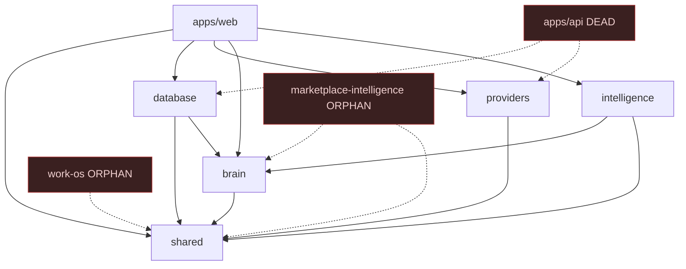

# 02 — Repository Map

**Audit branch:** `chore/engineering-audit` · **Baseline commit:** `ab830f8` (production `main`)
**Toolchain:** Turborepo + npm workspaces · `packageManager npm@10.8.2` · `engines.node >=20`

> Evidence for every claim below is a tracked file. Import counts are `grep -rl "@emgloop/<pkg>"` across `apps`/`packages` excluding the package's own directory; LOC is `find … -name '*.ts*' | xargs wc -l`.

---

## 1. Workspace inventory

| Workspace | Path | LOC | External importers | Classification |
|---|---|---:|---:|---|
| `@emgloop/web` | `apps/web` | 39,935 | — (top consumer) | **Production-ready** (the only deployed artifact) |
| `@emgloop/database` | `packages/database` | 17,404 | 75 | **Production-ready** (backbone) |
| `@emgloop/shared` | `packages/shared` | 2,968 | 54 | **Production-ready** (most-imported) |
| `@emgloop/providers` | `packages/providers` | 5,431 | 18 | **Functional but incomplete** (2 real adapters, rest mock) |
| `@emgloop/brain` | `packages/brain` | 4,606 | 15 | **Prototype** (largely type declarations) |
| `@emgloop/intelligence` | `packages/intelligence` | 5,879 | 5 | **Prototype** (analytics over brain/shared) |
| `@emgloop/marketplace-intelligence` | `packages/marketplace-intelligence` | 2,418 | **0** | **Unused / Orphan** |
| `@emgloop/work-os` | `packages/work-os` | 1,957 | **0** | **Unused / Orphan** (dead contracts; runtime uses `database/src/work-os/`) |
| `@emgloop/api` | `apps/api` | 44 | **0** | **Unused / Scaffold** (44-LOC stub, not deployed) |

**Total orphaned/dead code:** ~4,375 LOC across `marketplace-intelligence` + `work-os`, plus the 44-LOC `apps/api` stub. None is imported anywhere via a static `@emgloop/*` path.

> ⚠️ Correction to `CLAUDE.md`: the constitution lists 6 packages and omits **`packages/intelligence`** (5,879 LOC, 5 importers), which was introduced by PR #136 ("split CallGrid Intelligence and Brain into one owner each"). The real count is **7 packages + 2 apps**.

---

## 2. Responsibility of each workspace

- **`apps/web`** — Next.js 14 App Router product. Contains the older **CRM** surface (`src/app/crm`), the newer **Loop OS** admin/employee surface (`src/app/app`), the real API tier (`src/app/api`), plus `auth/`, `workspaces/`, `crm/` (server actions), `demo/`, `lib/`. **This is the only thing Netlify deploys.**
- **`packages/database`** — Prisma schema + generated client, repositories, and cross-repository domain services (work-os, ingestion, CallGrid reconciliation, verified-knowledge, revenue intelligence). 75 importers — the true center of gravity.
- **`packages/shared`** — cross-cutting primitives: the Truth model, business-time/CallGrid windows, identity, knowledge contracts, metric-trend, nav-match. Pure, well-tested, most widely imported (54).
- **`packages/providers`** — external-integration adapters (CallGrid, Website), webhook security, Resend email, and **mocks** for the rest. Only third-party runtime dep: `resend`.
- **`packages/brain`** — decisioning/knowledge layer: next-best-action, pipeline, signals, briefings, diagnostics, trust, memory. Contract-heavy.
- **`packages/intelligence`** — coverage/executive/marketplace analytics; re-exports over brain/shared.
- **`packages/marketplace-intelligence`** — CallGrid funnel + buyer/vendor/source/campaign profitability. **Orphan** — its public entry is imported nowhere; also has pre-existing typecheck errors (see `13-testing-report`/validation).
- **`packages/work-os`** — work-item/workflow domain model (stages, states, transitions, governance). **Orphan** — the live Work OS logic lives in `packages/database/src/work-os/`, not here. This is the "package named for the dead implementation" that `CLAUDE.md` warns about.
- **`apps/api`** — a single 44-LOC tsx/node stub (`src/index.ts`). Depends on database/providers/shared; nothing imports it; not deployed. A stale gitignored `apps/api/dist/` exists as build residue.

---

## 3. Dependency direction (current)

- Intelligence flows **up** (shared → database/brain → web), matching the intended model — with one tolerated inversion: `database → brain` (documented in `CLAUDE.md`, not to be copied).
- No circular `@emgloop/*` package cycles were found via static import analysis. *(Dynamic/string references not verified — see Open Questions.)*

---

## 4. Build & config topology

| Concern | Where | Notes |
|---|---|---|
| Task runner | `turbo.json` | tasks: `build` (`^build`, outputs `.next/**`,`dist/**`), `dev`, `lint` (empty), `typecheck` (`^build`). **No `test` task in turbo.** |
| TS config | `tsconfig.base.json` | `strict`, `noUncheckedIndexedAccess`, `noImplicitOverride`, ES2022, `moduleResolution: Bundler`. All packages extend it. |
| Path alias | `apps/web/tsconfig.json` | `@/*` → `./src/*`. No `@emgloop/*` paths mapping (resolved via workspace symlinks + `transpilePackages`). |
| Bundler | `apps/web/next.config.mjs` | `transpilePackages: ['@emgloop/shared','@emgloop/database','@emgloop/providers']` — **`brain` and `intelligence` are imported by web but NOT listed** (⚠️ verify this is not a latent server/client boundary bug). |
| Build scripts | per-package | Only `web` (`next build`), `api` (`tsc`), `database` (`prisma generate`) build. Other packages ship raw TS via `main: ./src/index.ts`. |
| Test scripts | per-package | Only `shared`, `providers`, `database` define `test` (`node --import tsx --test`). No root/turbo test wiring. |
| Lint | — | **No ESLint config and no `eslint` dependency anywhere.** Only `web` declares a `next lint` script, which has no config to run. |
| Lockfile | `package-lock.json` | ⚠️ **Committed** (tracked, 50 KB). Contradicts `CLAUDE.md` ("untracked by convention") and all 3 CI workflows, which still use `npm install` and claim "no committed lockfile." **Drift — CI should move to `npm ci`.** |

---

## 5. Deployment topology

- **`netlify.toml`**: build `npm run build -- --filter=@emgloop/web`, publish `apps/web/.next`, `NODE_VERSION=22`, `NPM_FLAGS=--include=dev`, plugin `@netlify/plugin-nextjs`. **No redirects, headers, `[functions]`, or per-context env blocks. No migration step at build.**
- **`.github/workflows/`** (3, all Node 20):
  - `deploy-prisma-migrations.yml` — `workflow_dispatch` only; `prisma migrate deploy` against `DIRECT_DATABASE_URL`.
  - `prisma-baseline-recovery.yml` — `workflow_dispatch` only; requires a typed confirmation phrase; runs `scripts/recovery/baseline-and-migrate.sh`.
  - `verified-knowledge-ci.yml` — the **only** PR check on `main`; typechecks + tests **only** `@emgloop/shared` + `@emgloop/database` (deliberately scoped to avoid known-broken packages).
- **No repo-wide build/typecheck/lint gate on `main`.** Node version is inconsistent across `engines` (>=20), Netlify (22), and CI (20).

---

## 6. Dead / duplicate code (consolidation targets)

- **Orphan packages:** `marketplace-intelligence`, `work-os` (0 importers each). `apps/api` stub.
- **Sprint-named files** (a named anti-pattern in `CLAUDE.md`): `crm/sprint7.css…sprint16.css` (5 files); migrations `…_sprint_4_real_data_layer`, `…_sprint_11_…`; comments in `next.config.mjs` ("Sprint 17") and `.env.example` ("Sprint 1").
- **Duplicated formatters** despite a canonical `apps/web/src/app/app/_loop-os/format.ts`:
  - `relTime` — **10 definitions** (9 copy-pasted across CRM/admin pages).
  - `money` — **6+ definitions** across CRM/admin pages.
- **Env drift:** `.env.example` documents keys code never reads (`SETUP_SECRET`, `AI_*`, `VOICE_*`, `SMS_*`, `PAYMENT_*`, `CALENDAR_*`) and **omits keys code does read** (`CALLGRID_API_BASE_URL`, `CALLGRID_API_KEY`, `CALLGRID_WEBHOOK_SECRET`, `WEBSITE_WEBHOOK_SECRET`).

**Env vars actually referenced in code:** `APP_URL`, `NEXT_PUBLIC_APP_URL` (the only browser-exposed one), `DATABASE_URL`, `CALLGRID_API_BASE_URL`, `CALLGRID_API_KEY`, `CALLGRID_WEBHOOK_SECRET`, `WEBSITE_WEBHOOK_SECRET`, `LOOP_EVENT_SECRET`, `RESEND_API_KEY`, `LOOP_EMAIL_FROM`, `LOOP_EMAIL_REPLY_TO`, `LOOP_ACCESS_REQUEST_TO`, `CONTEXT`, `NODE_ENV`.

---

## 7. Recommended ownership (for a growing team)

| Area | Workspace(s) | Suggested owner |
|---|---|---|
| Product shell + routes | `apps/web` (`app/`, `crm/`, `workspaces/`) | Frontend/Platform |
| Persistence + services | `packages/database` | Backend/Data |
| Domain contracts | `packages/shared` | Architecture (guarded — incoherent today) |
| Integrations | `packages/providers` | Integrations |
| Intelligence | `packages/brain`, `packages/intelligence` | Brain/ML (future) |
| **Retire** | `packages/work-os`, `packages/marketplace-intelligence`, `apps/api` | Delete per the replacement rule |

See `15-technical-debt-register` for the retirement plan and `17-engineering-roadmap` Phase A for build/CI stabilization.
