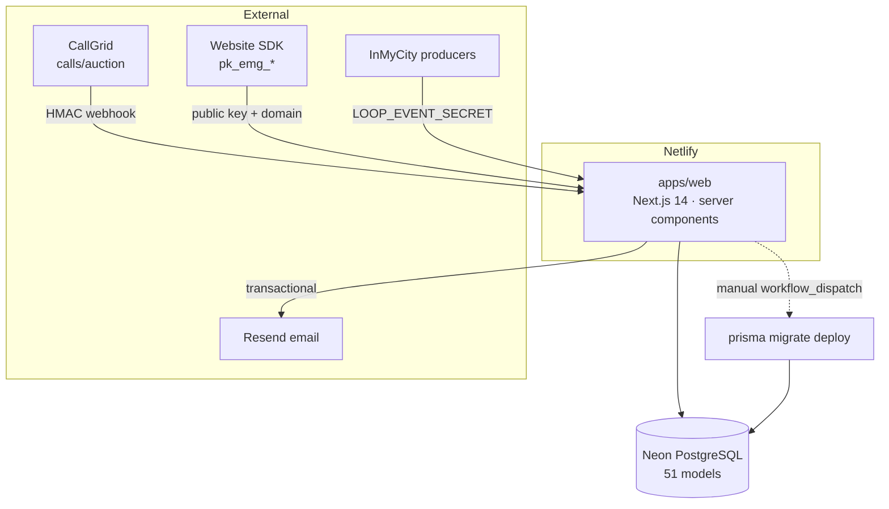
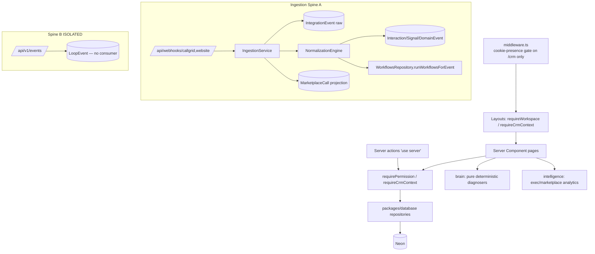

# 03 — Current-State Architecture

**One deployable:** `apps/web` (Next.js 14 App Router) on Netlify. Everything else is a workspace library it imports (or dead code). PostgreSQL (Neon) via Prisma. No separate API service, no queue, no worker, no event bus, no LLM.

---

## 1. System context

## 2. Internal layers & data flow

**Key properties (verified):**
- **Server-component-first** — 6 client leaves, no client pages/layouts. Post-login routing in one place (`app/app/page.tsx`).
- **Repository pattern** — feature code goes through `packages/database` repositories (org-scoped, mostly fail-closed).
- **Auth** — cookie `emgloop_session`, scrypt + per-user salt, SHA-256 token-at-rest, `timingSafeEqual`. Edge middleware checks cookie presence; real enforcement in server guards.
- **RBAC** — deny-by-default 12×5 matrix, DENY-wins, additive user `Permission` rows.
- **Ingestion** — synchronous, in-request, provider-agnostic at the `InboundEvent` boundary (Spine A); a second isolated store (Spine B) with no consumer.
- **Intelligence** — pure functions (`brain`), no I/O; the one live Brain endpoint is unlinked and read-only.

## 3. What is NOT there (structural absences)

| Missing | Consequence |
|---|---|
| Queue / worker / DLQ | All ingestion + enrichment runs in the webhook request; failures block the response; 200-on-failure loses data |
| Event bus | `DomainEvent`/`LoopEvent` are stores without dispatch; every consumer is inline; no fan-out |
| Multi-tenant ingestion | `LIVE_ORG_SLUG` hard-binds all webhooks to one tenant; global unique keys collide across tenants |
| Membership model | One org per user; no super-admin, no org switcher |
| LLM | "AI" is a deterministic mock; AI Employees are config-only |
| Scheduler / cron | SCHEDULE workflows + due dates never fire |
| Accounting domain | No invoice/bill/payment/reconciliation models |
| Real CI gate + tests | Only a scoped PR check; ~a handful of test files; human attention is the only guarantee |
| Work-OS ↔ CRM linkage | Work is an island; no organizational memory tie-in |

## 4. Boundary health

Intelligence flows **up** (providers → DB → brain → UI) as intended, with one tolerated inversion (`database → brain`). Violations to watch: `NormalizationEngine` is a service in a `*.repository.ts` file; some `WorkRepository` methods take no org arg; two orphan packages (`work-os`, `marketplace-intelligence`) and a dead `apps/api` embody the "parallel systems" failure mode.

See `04-target-architecture` for where this should go, and `17-engineering-roadmap` for the ordered path.
