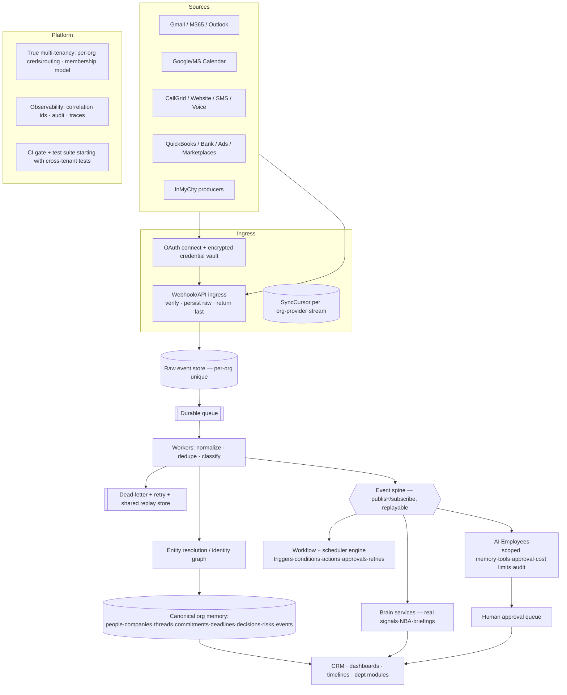

# 04 — Target-State Architecture

The target is the product vision made buildable: an **organizational-memory + automation OS** that ingests many providers, normalizes into a canonical graph, reasons over it, and lets AI Employees act **under human approval**. The order of construction matters — each layer below is a prerequisite for the next (mirrors `17-engineering-roadmap`).

## Deltas from current state (what to build, in order)

| Layer | Today | Target | Roadmap phase |
|---|---|---|---|
| **Tenancy** | `LIVE_ORG_SLUG`, global unique keys, 1 org/user | per-org routing + credentials, org-scoped keys, membership model | Phase B / #1 |
| **Floor** | ~handful of tests, scoped PR check, uncommitted-lockfile assumption | committed lockfile + `npm ci`, repo-wide CI gate, cross-tenant test suite | Phase A/B / #2 |
| **Domain/DB** | 51 models, 14 org-FK gaps, no memory graph | canonical entities + activity/event + FKs + audit + entity resolution | Phase C / #3 |
| **Integrations** | 3 real adapters, no connection lifecycle | OAuth, credential vault, sync cursors, health, retries, rate limits | Phase D / #1,#3 |
| **Async spine** | synchronous webhooks, no bus | persist-fast + queue + workers + DLQ + event bus + scheduler | Phase E / #3 |
| **Memory** | isolated Interaction rows, no resolution | identity graph, relationships, provenance, searchable history | Phase E / #3 |
| **Work OS** | island, no CRM links, SCHEDULE inert | tasks linked to records, reminders/escalations, one workflow model | Phase F / #4 |
| **Brain** | pure deterministic, unlinked | real signals + NBA + briefings over real memory | Phase G / #5 |
| **AI Employees** | config-only identities | scoped, tool-using, approval-gated, audited actors | Phase G / #6 (last) |

## Design principles to hold (from CLAUDE.md, validated by this audit)

1. **Extend or replace — never add a parallel system.** (We already carry 3 workflow systems, 2 shells, 2 orphan packages.)
2. **Scope at the data layer, fail closed to null.** (The `AIEmployeeRepository` pattern is the template.)
3. **Own the intelligence, rent the plumbing.** (Provider abstraction is good; keep vendor types out of domain code.)
4. **Honesty is a feature.** (Truth model: Unknown ≠ zero. Never fake AI/metrics/functionality.)
5. **Async before smart.** (No AI Employees until tenancy + spine + tests exist.)

## Single collapse targets (retire, don't accumulate)

- Fold the dead `@emgloop/work-os` and `@emgloop/marketplace-intelligence` packages and `apps/api` — delete after confirming zero dynamic references.
- Collapse the 4 competing architecture docs + `EVENT_BUS.md` into one accurate `ARCHITECTURE.md`.
- One token set, one shell (Phase 4 shell unification — plan first).

See `16-stabilization-plan` for Phase 0–3 and `17-engineering-roadmap` for the full A–I sequence.
