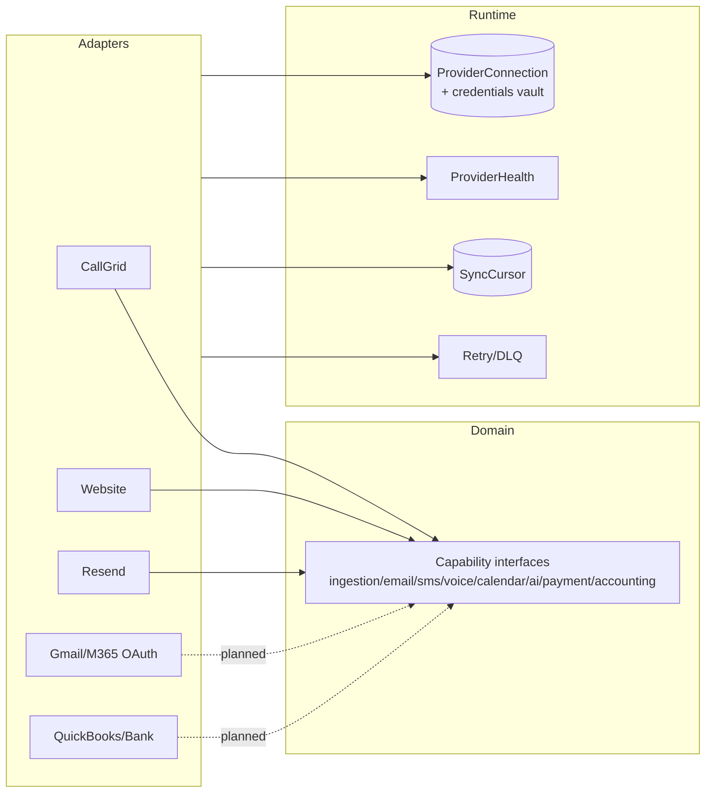

# 09 — Provider & Integration Architecture Review

**Structure:** interfaces in `packages/providers/src/interfaces/*`, real adapters in `adapters/*`, mocks in `mocks/*`, resolved via a category+id registry (`registry.ts`). Nothing auto-registers; hosts wire adapters on first use (`getCallGridProvider()`, `getWebsiteProvider()`).

**Integrity verdict:** **No silent mock fallback, no vendor-type leakage** — the provider layer is honest and fail-closed. The gap is *coverage*: most capabilities are mock-only.

---

## 1. Capability matrix (verified)

| Capability | Interface | Real adapter | Mock | Status |
|---|---|---|---|---|
| **Ingestion / CallGrid** | `ingestion.provider.ts` | `callgrid.provider.ts` (+ REST `callgrid-api.ts`, reports client) | `ingestion.mock.ts` | **REAL** |
| **Ingestion / Website** | (same) | `website.provider.ts` | (shared) | **REAL (partial)** |
| **Email** | `email.provider.ts` | `resend-email.provider.ts` | `mock-email.provider.ts` | **REAL (Resend)** |
| AI / LLM | `ai.provider.ts` | **none** | `mock-ai.provider.ts` | **Mock only** |
| SMS | `sms.provider.ts` | none | `mock-sms.provider.ts` | Mock only |
| Voice | `voice.provider.ts` | none | `mock-voice.provider.ts` | Mock only |
| Calendar | `calendar.provider.ts` | none | `mock-calendar.provider.ts` | Mock only |
| Analytics | `analytics.provider.ts` | none | `analytics.mock.ts` | Mock only |
| Payment | `payment.provider.ts` | none | **none** | Interface only |
| Accounting | — | none | none | Not modelled |

CLAUDE.md's "CallGrid, Resend, Website real; rest mocks" is **accurate**.

---

## 2. Findings

### Finding PROV-001 — Informational (strength to preserve) — Integration
**No mock can silently run in production.** The registry **throws** if an adapter is missing (`registry.ts:42-48`) — never returns a mock. The email service **throws** in production on a missing `RESEND_API_KEY`/`LOOP_EMAIL_FROM` (`email-service.ts:82-93`, "never pretend delivery succeeded"); only non-prod logs and skips. Mocks are wired **only** into the `/demo` sandbox (`apps/web/src/demo/*`); `registerMockProviders()` has zero app callers. **Preserve this discipline** — it is the "honesty is a feature" principle working.

### Finding PROV-002 — Informational — Integration
**No vendor SDK types leak into domain code.** The only `import ... from 'resend'` is inside the adapter; `email-service.ts` explicitly forbids importing `resend` directly. CallGrid/Website adapters import **no** vendor SDK — pure wire-format translation to the neutral `InboundEvent` shape. Vendor *names* appear only as catalog data (`integration-catalog.ts`, `shared` provider registry), not types.

### Finding PROV-003 — Medium — Integration / Architecture
**Title:** No provider-connection health, retry, rate-limit, usage/cost, or credential-vault layer — provider config is a lazily-provisioned `ProviderConnection` row with `credentialsRef` and `lastSyncedAt`.
**Evidence:** `ProviderConnection` model; webhook routes lazily provision a connection; diagnostics are written to `connection.config` and swallowed on failure. No per-provider retry/backoff, no rate-limit accounting, no cost tracking, no secret storage beyond env vars + a `credentialsRef` string.
**Why it matters:** The target platform integrates dozens of providers (Gmail, M365, QuickBooks, banking, ad platforms). Without a connection-lifecycle model (connect → healthy/degraded → token-refresh → disconnect) and per-provider throttling, each new integration becomes a bespoke silo — the exact failure mode CLAUDE.md warns of.
**Recommendation:** Build the connection-lifecycle + credential-vault + health/retry layer as Roadmap **Phase D** before adding OAuth providers. Reuse `ProviderConnection` + `IntegrationEvent`; add `SyncCursor`, encrypted credential storage, and a `ProviderHealth` projection.
**Effort:** Large / Multi-phase. **Priority:** Before email/calendar/accounting integrations.

### Finding PROV-004 — Medium — Integration
**Title:** Two ingestion spines that never meet.
**Evidence:** **Spine A** (`IngestionService`): CallGrid + Website → `IntegrationEvent` → `NormalizationEngine` → Interaction/Signal/DomainEvent → CRM Workflows + MarketplaceCall projection + NBA — genuinely provider-agnostic at the `InboundEvent` boundary. **Spine B** (`/api/v1/events` → `LoopEvent`): separate auth, table, dedupe, and **no bridge into Spine A** — events landing here are inert.
**Why it matters:** Anything sent to the Loop Event Gateway never becomes organizational memory. Adding the InMyCity producer network on top of Spine B, as designed, produces a silo.
**Recommendation:** Bridge Spine B into the normalization pipeline (a `LoopEvent` consumer that emits `InboundEvent`s), or fold the gateway into Spine A. See `10-ai-and-workflow-review`.
**Effort:** Medium. **Priority:** Phase D/E.

---

## 3. Recommended provider architecture (target)

Clearly separate: **domain capabilities** (stable interfaces) · **vendor adapters** (replaceable) · **connection config + encrypted credentials** · **health/usage/cost** · **retries/rate-limits**. The interface layer is already good; the runtime layer (connection lifecycle, health, cursors, retries, cost) is what's missing.

Cross-refs: AI reality → `10`; ingestion detail → `10`; email→ handled; security of shared secret → `06`/`11`.
