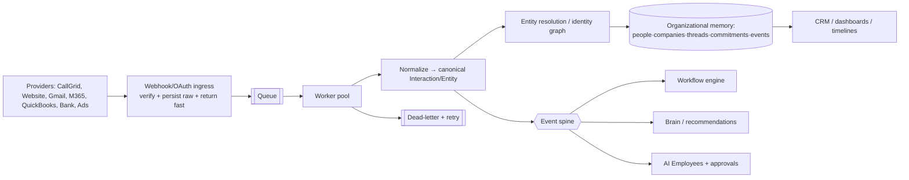

# 10 — AI, Workflow, Ingestion & Organizational-Memory Review

Covers: AI reality, AI Employees, the three workflow systems, tasks, the ingestion pipeline, events, and accounting readiness. This is the heart of "how far is the product from the vision."

---

## A. AI — what is real

**There is no LLM anywhere in the codebase.** Verified by repo-wide grep: no `@anthropic-ai/*`, `openai`, or any LLM SDK in any `package.json`; every `anthropic`/`openai` hit is a *planned* catalog id, a comment, or the demo's in-memory `store.messages.create`. The `AIProvider` interface (`ai.provider.ts`) is a clean vendor-neutral contract, but its only implementation is `MockAIProvider` — an explicit keyword heuristic returning canned strings ("Real model reasoning replaces this entirely behind the same interface").

**The "Brain" is real but deterministic.** `packages/brain` is **pure** (no fetch/prisma/env/clock/RNG — verified). `demonstrateBrainActivityFlow` / `assembleAndRunCallHandlingFlow` is a hand-written decision tree over call metrics (observe → diagnose via `buyerCallHandlingDiagnoser` → author a `RecommendationEnvelope` → publish an immutable `BrainActivity`). The one live Brain runtime path is `api/brain/call-handling-briefing` — gated on `intelligence:manage`, **read-only, and linked from no page**. `BrainService` and its 11 sub-services (`SignalRegistryService`, `IntentService`, `KnowledgeService`, `RecommendationService`, `NextBestActionService`, `MemoryService`, `TrustService`, …) are **interface names with no implementation**.

> **Verdict:** AI is honest and abstraction-ready, but **not built**. The product never claims otherwise — the AI-Employees UI literally says "configuration only, no live providers." Preserve that honesty (CLAUDE.md Principle #2).

### AI Employees
`AIEmployee` (schema `:660`) is a **config/identity record** — `channels`, `operatingHours`, `escalationRules`, `dnaOverrides`, `knowledgeAccess`, `providerPrefs` (all JSON) are **written and displayed but read by no runtime**. `AIAgent` (the intended execution runtime) is never instantiated to run anything. Repo is org-scoped and fail-closed (`updateEmployee(organizationId, id, fields)` → `findFirst({id, organizationId})` → null on cross-org). **No `AIEmployeeRef` type exists** — the referenced prior bug is gone. *Finding AI-001 — Informational: AI Employees are assignable identities that do not act; keep the UI honest before wiring any provider.*

### Recommended AI-Employee architecture (when the LLM lands — Roadmap Phase G, last)
Identity + role + org + department · explicit **permissions & allowed/forbidden tools** · scoped **memory & knowledge** · **approval requirements** before any external action · **cost & action limits** · **escalation rules** · full **audit/execution history with citations** · **human override**. Build this on top of: real tenancy (Phase 1), an async spine (Phase 3), and a test floor (Phase 2) — never before.

---

## B. Workflow systems — there are three (CLAUDE.md confirmed)

| # | System | Location | Status |
|---|---|---|---|
| 1 | **CRM Workflows** (trigger→condition→action automation) | `workflows.repository.ts` + `/crm/workflows/*` + `Workflow`/`WorkflowRun` tables | **REAL**; EVENT+MANUAL execute, wired to ingestion via `runWorkflowsForEvent` |
| 2 | **Work OS Workflow Templates** (human sequential step handoff) | `work.repository.ts` (`createWorkItem`/`completeWorkStep`) + `database/src/work-os/workflow.ts` | **REAL**; human execution only |
| 3 | **`@emgloop/work-os` package** (states/rules/transitions/stages) | `packages/work-os/src/*` | **DEAD** — 0 importers, not even a declared dependency |

There is arguably a **fourth**: the older `createWorkFromBlueprint` path coexists with the newer `createWorkItem` path *inside* system #2's file.

### Finding WF-001 — Medium — Workflow
**Title:** CRM Workflow `SCHEDULE` trigger is inert — there is no scheduler/cron anywhere.
**Evidence:** `workflows.repository.ts:56` ("a human cron-ish hint, not executed in this phase"); repo-wide grep finds no cron/scheduler. `WorkStage.targetAtUtc` due-dates are stored but nothing fires on them.
**Why it matters:** Reminders, deadline escalation, and recurring work — all core to the vision — cannot function without a scheduler. Users may create SCHEDULE workflows that never run.
**Recommendation:** Either hide SCHEDULE until a scheduler exists, or build the scheduled-job runner (Roadmap Phase F, on the async spine). Never present an inert trigger as active.
**Effort:** Medium. **Priority:** Before promising automation/reminders.

### Finding WF-002 — High — Architecture / Product
**Title:** Work OS is fully siloed from the CRM record graph — no link between work/tasks and customers, calls, conversations, or events.
**Evidence:** `CreateWorkItemInput.relatedRecord` exists but Start Work **always passes `null`** (`work/actions.ts:229` — "no first-class record source exists to link yet"). No FK/join from Work OS to `Customer`/`Interaction`/`Conversation`/`DomainEvent`/`LoopEvent`.
**Why it matters:** The product's thesis is organizational memory — "who did what for which customer." Today you cannot start work from a call or customer, and work never appears on a customer timeline. Operational memory and record memory are disconnected.
**Recommendation:** Add a polymorphic `relatedRecord` link (org-scoped) and surface work on customer timelines; make "Start work from this call/customer" a first-class action. (Roadmap Phase E/F.)
**Effort:** Medium. **Priority:** Before AI Employees (they'd need this linkage to act meaningfully).

### Tasks
**No `Task` model.** The closest primitive is a one-step Work Type (`WorkInstance`+`WorkStage`, auto-"Complete" stage). Assignment/completion/in-app notification/comments work; **no email/SMS/push, no due-date firing, no recurring work.** The system cannot yet distinguish suggested vs approved vs assigned vs recurring at the model level.

---

## C. Ingestion & Organizational Memory

**Spine A (real, reusable):** webhook → resolve org via `LIVE_ORG_SLUG` → provision `ProviderConnection` → `verifyWebhook` (HMAC) → `parseWebhook` → **`IngestionService.ingest` (synchronous, in-request)**:
- **Raw event stored first** (`IntegrationEvent` RECEIVED→PROCESSING→PROCESSED/FAILED). ✅
- **Dedup** on `(provider, externalId)` — but **global, not per-org** (DB-002). ⚠️
- **Entity resolution:** basic — phone last-7-digit `contains` + email exact, else create; anonymous web visitors keyed `web-visitor:<id>`. No identity graph.
- **Normalize** (`NormalizationEngine`) → `Interaction` + `Signal` + `DomainEvent(integration.*)` → fires CRM Workflows.
- **Project** to `MarketplaceCall` (non-fatal, rebuildable) + **enrich** (Signals, rules-based NBA).

**Spine B (isolated silo):** `/api/v1/events` → `LoopEvent` store. Separate auth (`LOOP_EVENT_SECRET`), separate table, own dedupe (`eventId`), **no bridge to Spine A**, **no consumer** (`markLoopEventProcessed`/`listLoopEvents` have zero callers). Write-only dead-end.

### Finding ING-001 — High — Architecture / Scale
**Title:** Ingestion is fully synchronous in the request path — no queue, worker, DLQ, or shared replay store.
**Evidence:** grep finds no queue/worker/broker; the webhook runs normalize→project→enrich→NBA before returning; replay protection is an in-memory per-instance `Map` ("decorative on serverless"); combined with the 200-on-failure contract (API-002).
**Why it matters:** Slow/failing enrichment blocks the provider response; a serverless cold instance loses replay state; a failed downstream step + `200` = silent loss. This is the #1 scale/reliability risk as volume grows.
**Recommendation:** Persist raw + return fast; move processing to a worker with retries + DLQ + shared (Redis/DB) replay store; fix the 200-on-failure contract (Roadmap Phase 3). Add a `SyncCursor` model.
**Effort:** Large / Multi-phase. **Priority:** Before high-volume ingestion (email/webhooks at scale).

### Finding ING-002 — High — Architecture
**Title:** No event bus; `LoopEvent` gateway has no consumer.
**Evidence:** grep for `EventBus|publish(|subscribe(` → zero. `docs/EVENT_BUS.md` describes an unbuilt bus cited by 10 docs. `DomainEvent` rows are queried directly by the workflow engine in the same request (no fan-out). `LoopEvent` is never consumed.
**Why it matters:** Every new cross-domain need becomes another inline one-off; Spine B events never become memory. This is CLAUDE.md Long-Term Goal #3.
**Recommendation:** Introduce a real async event spine (persist + dispatch + subscribers) OR delete the gateway and `EVENT_BUS.md`. Bridge `LoopEvent` into normalization. Don't cite the bus in more docs until it exists.
**Effort:** Large. **Priority:** Phase 3.

### Target ingestion / memory architecture

---

## D. Accounting Center readiness — schema essentially absent

**No invoice/bill/payment/reconciliation/ledger/bank models exist.** Money is fields only (`Order.*Cents`, `MarketplaceCall.revenueCents/payoutCents/costCents`, Marketplace snapshots). `ProviderCategory.PAYMENT` enum exists with no backing tables.

**Minimum domain for the CallGrid-invoice reconciliation workflow (Roadmap Phase H):**
`Invoice` · `InvoiceLineItem` · `Bill` · `Payment` · `Customer`/`Vendor` (exist) · `ReportingPeriod` · `SourceSystemRecord` (link invoice ↔ CallGrid source/campaign + period — `MarketplaceCall`/snapshots already hold the reporting side) · `ReconciliationRecord` · `Discrepancy` · `Approval` · `Attachment` · `AccountingConnection`/`BankConnection` (via `ProviderConnection`). The CallGrid reporting half already exists (`MarketplaceCall`, auction snapshots, reconciliation *routes*) — the **finance half is greenfield**. Build the domain first; do not implement during stabilization.

Cross-refs: DB gaps → `07`; provider runtime → `09`; async spine + queue → `12`, `17` Phase 3; security of `LOOP_EVENT_SECRET` → `06`/`11`.
